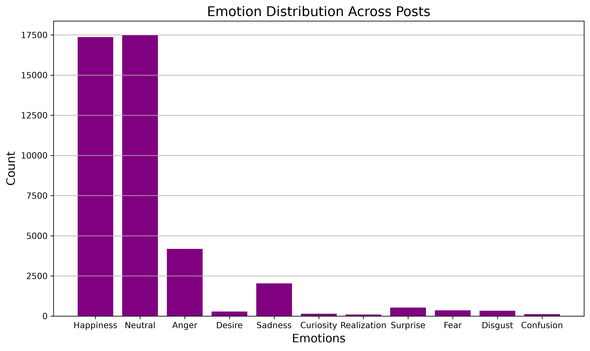
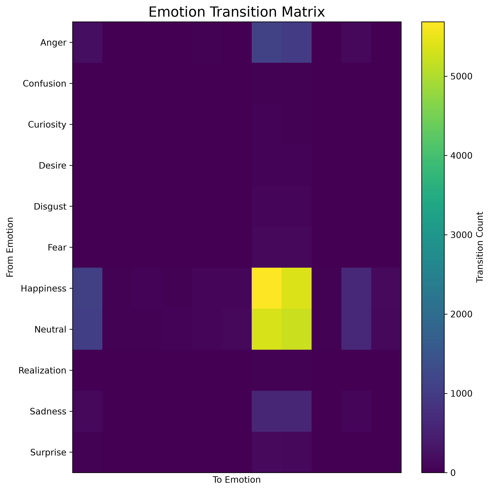
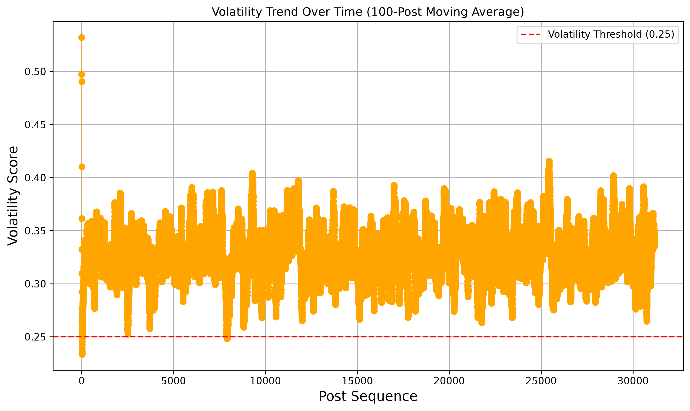

# AffectLens


AffectLens is a Python-based emotional analytics toolkit that combines emotion classification, sentiment analysis, emotional volatility detection, and visual analytics to uncover emotional patterns in text datasets.

Built using traditional machine learning, ensemble sentiment analysis, and statistical volatility analysis, AffectLens transforms raw text into actionable emotional insights.

## Demo Video

https://www.youtube.com/watch?v=_XUKlRynPM4

---

## Features

### Emotion Analysis
- Multi-label emotion classification
- Confidence scores for predicted emotions
- Dominant emotion extraction
- Emotion distribution analysis

### Sentiment Analysis
- VADER sentiment scoring
- TextBlob sentiment scoring
- Weighted ensemble sentiment score

### Emotional Dynamics
- Emotional swing detection
- Emotional volatility analysis
- High-volatility flagging

### Optimization
- Classification threshold optimization
- Ensemble weight optimization
- Sentiment model comparison

### Visual Analytics
- Sentiment trend visualization
- Volatility trend visualization
- Emotional swing trend visualization
- Emotion distribution charts
- Emotion heatmaps
- Emotion transition matrices

### Engineering
- CSV dataset support
- Single-text analysis
- Command-line interface
- Automated test suite

---

## Results

### Emotion Classification Performance

| Metric | Score |
|----------|----------|
| Micro F1 Score | 0.539 |
| Macro F1 Score | 0.345 |
| Weighted F1 Score | 0.509 |
| Hamming Loss | 0.105 |

### Sentiment Analysis Performance

| Model | Error |
|----------|----------|
| VADER | 0.220 |
| TextBlob | 0.197 |
| Ensemble | 0.190 |

Lower error values indicate better sentiment prediction performance.

---

## Evaluation

The emotion classifier was evaluated on a held-out validation dataset using standard multi-label classification metrics:

- Micro F1 Score
- Macro F1 Score
- Weighted F1 Score
- Hamming Loss

The sentiment analysis module was evaluated using the Stanford Sentiment Treebank (SST) dataset, comparing:

- VADER
- TextBlob
- Weighted Ensemble

The ensemble model achieved the lowest prediction error among the evaluated approaches.

---

## Pipeline

```text
Input Text
    ↓
Preprocessing
    ↓
Emotion Classification
    ↓
Sentiment Analysis
    ↓
Ensemble Scoring
    ↓
Volatility Analysis
    ↓
Enriched Posts
    ↓
Visual Analytics
```

---

## Project Structure

```text
AffectLens/
│
├── affectlens/
│   ├── classifier.py
│   ├── data_loader.py
│   ├── evaluate.py
│   ├── preprocessing.py
│   ├── sentiment.py
│   ├── volatility.py
│   ├── visualization.py
│   └── constants.py
│
├── data/
├── models/
├── tests/
├── visualizations/
│
├── project.py
├── requirements.txt
├── LICENSE
└── README.md
```

The project follows a modular architecture where each component is responsible for a specific stage of the emotional analytics pipeline.

---

## Installation

```bash
git clone https://github.com/imaryapiyush99/AffectLens.git
cd AffectLens

python -m venv .venv

# macOS / Linux
source .venv/bin/activate

# Windows
.venv\Scripts\activate

pip install -r requirements.txt
```

---

## Included Datasets

The repository includes sample datasets for training, validation, and testing:

```text
data/training_data/train.csv
data/validation_data/validation.csv
data/test_data/test.csv
```

These datasets allow users to reproduce results and experiment with the project immediately after installation.

---

## Quick Start

### Train a Model

```bash
python project.py \
    --input_csv data/training_data/train.csv \
    --model_path models/model.joblib \
    --vectorizer_path models/vectorizers/vectorizer.joblib
```

### Analyze a Dataset

```bash
python project.py \
    --input_csv data/test_data/test.csv \
    --model_path models/model.joblib \
    --vectorizer_path models/vectorizers/vectorizer.joblib \
    --output_csv results/results.csv
```

### Analyze a Single Text

```bash
python project.py \
    --text "I am excited about finishing AffectLens." \
    --model_path models/model.joblib \
    --vectorizer_path models/vectorizers/vectorizer.joblib
```

### Generate Visualizations

```bash
python project.py \
    --visualize \
    --input_csv data/test_data/test.csv \
    --model_path models/model.joblib \
    --vectorizer_path models/vectorizers/vectorizer.joblib
```

---

## Example Analysis Summary

```text
========== AFFECTLENS SUMMARY ==========
Posts analyzed: 31,173

Average sentiment: 0.09
Average volatility: 0.33
Average emotional swing: 0.39

Most common emotion: Neutral

High-volatility posts: 22,783 (73.1%)
========================================
```

---

## Example Outputs

### Emotion Distribution



### Emotion Transition Matrix



### Volatility Trend



---

## Visualizations

- Sentiment Trend
- Volatility Trend
- Emotional Swing Trend
- Emotion Distribution
- Emotion Heatmap
- Emotion Transition Matrix

**Note:** If no timestamp column is provided, AffectLens assumes posts are already ordered chronologically and performs volatility analysis over post sequence rather than real time.

---

## Testing

Run all tests:

```bash
pytest -v
```

Current status:

```text
81 tests passing
```

---

## Tech Stack

### Core
- Python

### Machine Learning
- scikit-learn
- TF-IDF Vectorization
- Logistic Regression

### NLP
- TextBlob
- VADER Sentiment

### Visualization
- Matplotlib

### Model Persistence
- Joblib

### Testing
- pytest

---

## Future Improvements

- Transformer-based emotion classification
- Interactive dashboard
- Temporal emotion forecasting
- Topic-aware emotion analysis
- Adaptive volatility thresholds
- Emotion trajectory clustering
- Web application deployment

---

## Motivation

Traditional sentiment analysis reduces text to a single positive-to-negative score. Human emotions, however, are multi-dimensional and dynamic.

AffectLens was built to move beyond simple sentiment analysis by combining emotion classification, emotional volatility detection, transition analysis, and visualization into a unified emotional analytics pipeline.

---

## License

This project is licensed under the MIT License. See the LICENSE file for details.
